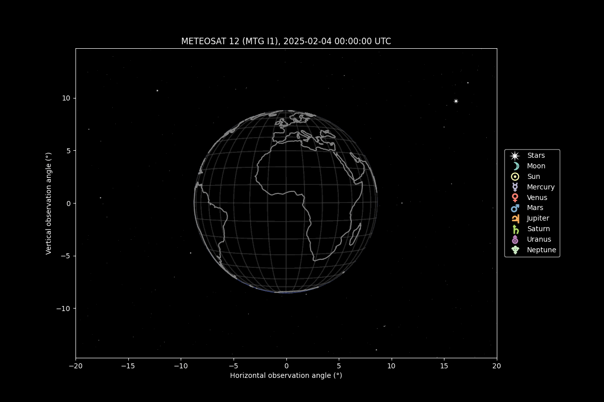

# satviewsim
Simulate the view of Earth, the solar system, and stars from an Earth-orbiting satellite. The calculations are based on [skyfield](https://rhodesmill.org/skyfield/).
### Installation
```
$ git clone https://github.com/andibarg/satviewsim.git
$ cd satviewsim
```
### Usage
Set the observer, the pointing target and the UTC time to instance the `SatelliteView` class of satviewsim. Star catalog, planets, and Earth's coastline data are downloaded upon instancing. Use the `plot.all()` function to display the satellite view in matplotlib. See a simple example below:
```python
from datetime import datetime
import matplotlib.pyplot as plt
from skyfield.api import EarthSatellite, wgs84
from modules.satviewsim import SatelliteView

# Time in UTC
utc_time = datetime(2025, 2, 4, 19, 0)

# Satellite name and two line element
satellite_name = 'METEOSAT 12 (MTG I1)'
satellite_tle = '''1 54743U 22170C   25021.33313354  .00000011  00000-0  00000-0 0  9992
2 54743   0.5918  35.3149 0001811 255.4605 309.9016  1.00269375  7841
'''

# Load savellite from TLE
sat = EarthSatellite(*satellite_tle.splitlines(),
                     satellite_name)

# Create view instance
view = SatelliteView(satellite=sat,
                     points_at=wgs84.latlon(0,0),
                     utc_time=utc_time)

# Plot
plt.style.use('dark_background')
fig = plt.figure(figsize=(12,8))
view.plot_all()
plt.xlim(-20,20)
plt.ylim(-12,12)
plt.show()

```
The utc time can be changed by setting a different `view.utc_time` and subsequently calling `view.plot.all()`. This way, you can visualized a time series like the one below:

